# GLYPHLAB

<p align="center">
  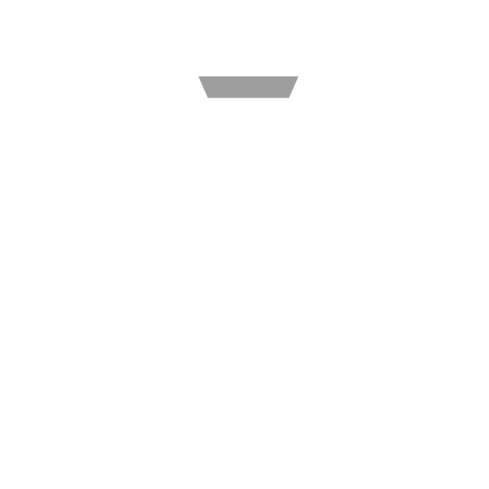
</p>

<h1 align="center">GLYPHLAB</h1>

<p align="center">
  <strong>Transform Pixels Into Colorized Character Art in Real-Time</strong>
</p>

<p align="center">
  
  
  
  
  
</p>

---

## 🔗 Links

* **GitHub Repository:** [https://github.com/Athxrv04/glyphlab](https://github.com/Athxrv04/glyphlab)
* **GitHub Profile:** [Atharv Sharma](https://github.com/Athxrv04)
* **LinkedIn:** [Atharv Sharma](https://www.linkedin.com/in/atharv-sharma-dev)

---

# About

**GLYPHLAB** is a high-performance, browser-based image-to-ASCII conversion engine wrapped in a retro developer terminal aesthetic. Designed with a "show, don't tell" philosophy, it features a split-layout landing page featuring a colorized, automated engine showcase, an interactive comparison slider, and dynamic performance metrics.

Unlike traditional text-based tools, GLYPHLAB operates entirely on the client-side using the HTML5 Canvas API—meaning zero server uploads, absolute privacy, and near-instant processing.

---

# Key Features

*   **Real-time Image Conversion:** Convert PNG, JPG, and WebP images to ASCII art instantly.
*   **Live Web camera Mode:** Stream webcam input directly into a real-time ASCII renderer.
*   **Coloured ASCII Art:** Fully supports colorized character output mapped dynamically from source pixel data.
*   **Before/After Comparison Slider:** Draggable divider to compare original source images with the generated ASCII output.
*   **Modular Presets:** Choose from Classic (` .:-=+*#%@`), Detailed, Terminal (` ░▒▓█`), and Pixel (` ▫▪□■`) presets, or supply custom character maps.
*   **Performance Metrics:** Real-time counters displaying images processed, characters generated, and render time (averaging under 12ms).
*   **Export Formats:** Export results directly as `.txt`, colored `.html`, `.png`, or vectorized `.svg`.
*   **Interactive Particle Background:** Ambient grid particles that dynamically adapt their character set to match the active slide content.
*   **Theme Engine:** Seamlessly toggle between White Terminal, Green CRT, Amber CRT, and Cyber Blue styles.

---

# Keyboard Shortcuts

Stay efficient with built-in keyboard controls:

| Shortcut | Action |
|:---:|---|
| <kbd>Ctrl</kbd> + <kbd>O</kbd> | Upload a new image |
| <kbd>Ctrl</kbd> + <kbd>C</kbd> | Copy ASCII art to clipboard |
| <kbd>Ctrl</kbd> + <kbd>S</kbd> | Save/Export output |
| <kbd>Space</kbd> | Toggle webcam stream (on Camera page) |
| <kbd>Esc</kbd> | Close Modals / About section |
| <kbd>←</kbd> / <kbd>→</kbd> | Navigate slideshow in Showcase |

---

# Screenshots

### Hero Showcase
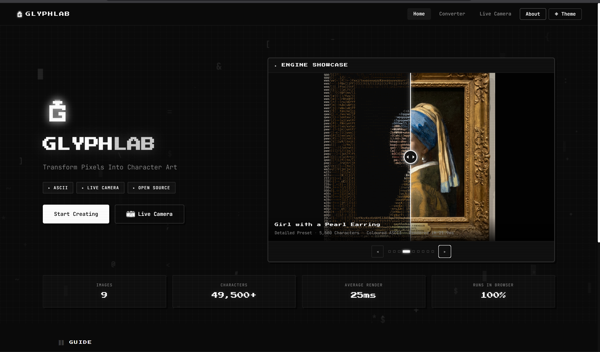

### Converter Workspace
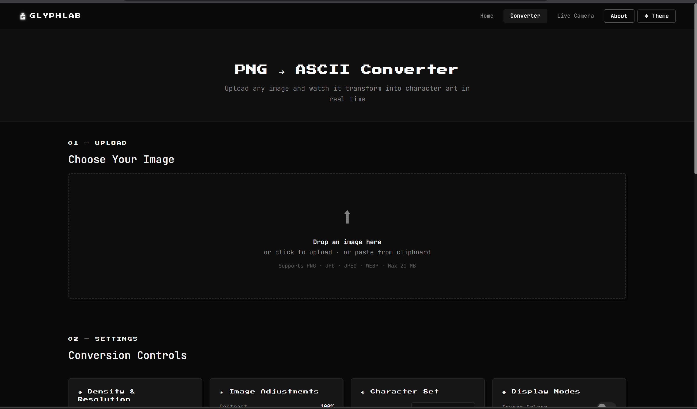

### Control Panel & Parameters
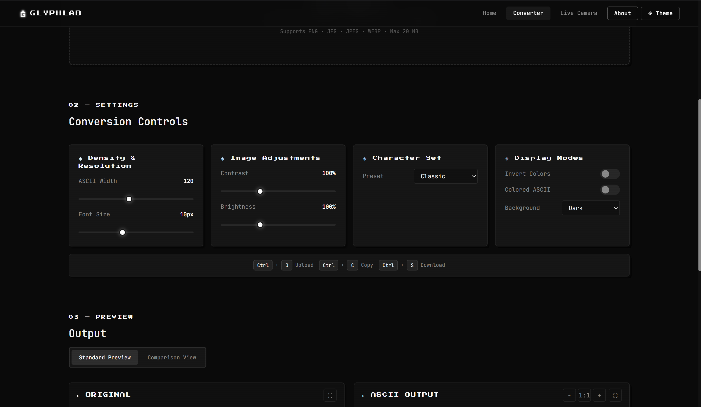

### ASCII Output & Sizing
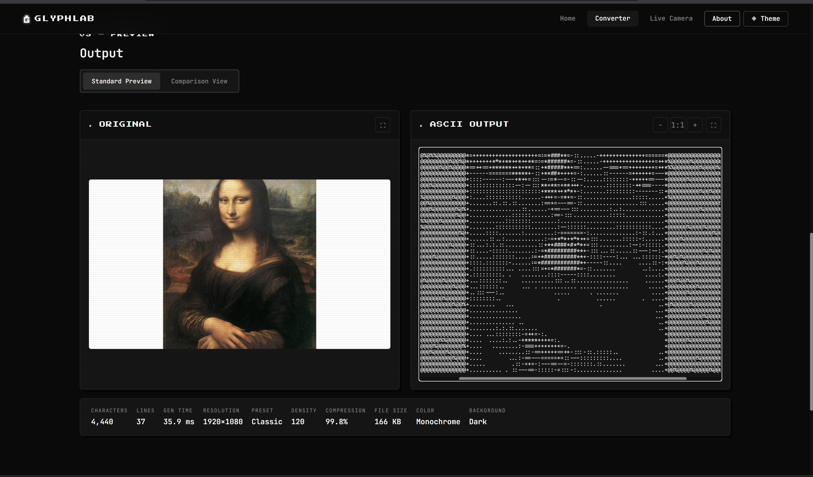

### Interactive Comparison Slider
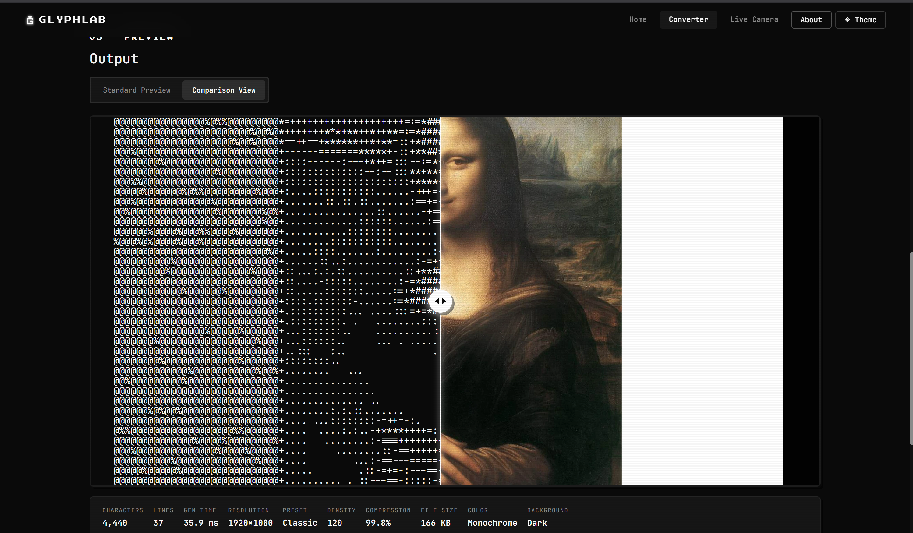

### Export Formats & Options
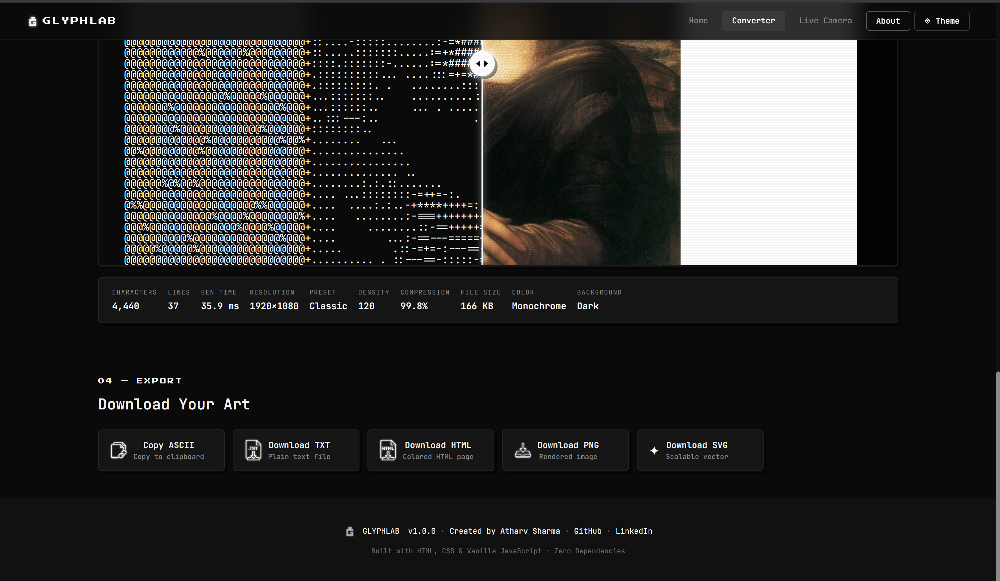

### Live Camera Mode
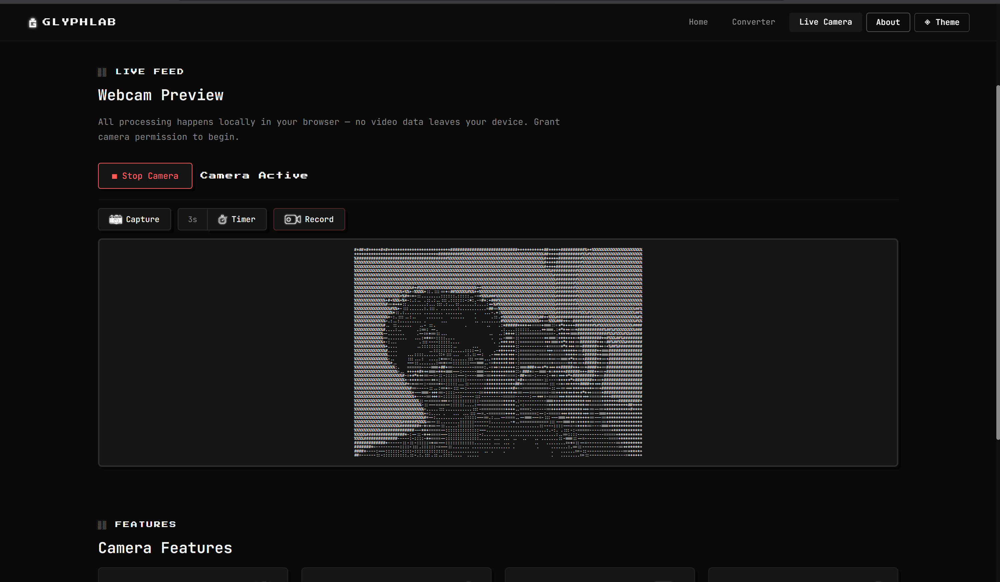

### Live Capture & Recording Preview
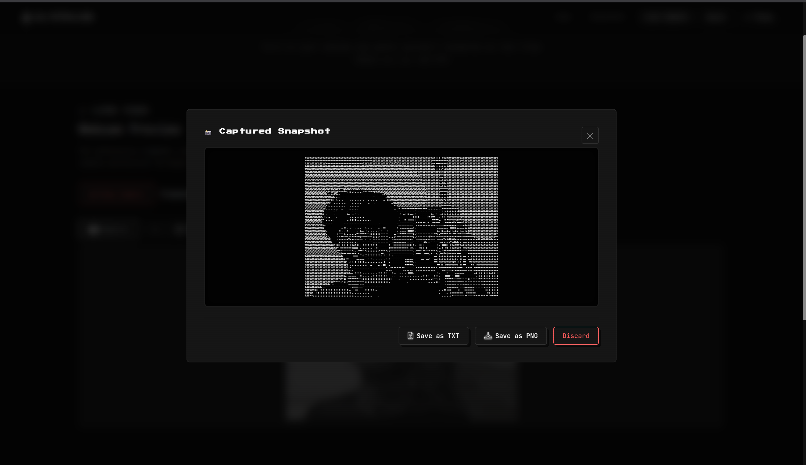

### Theme Customization
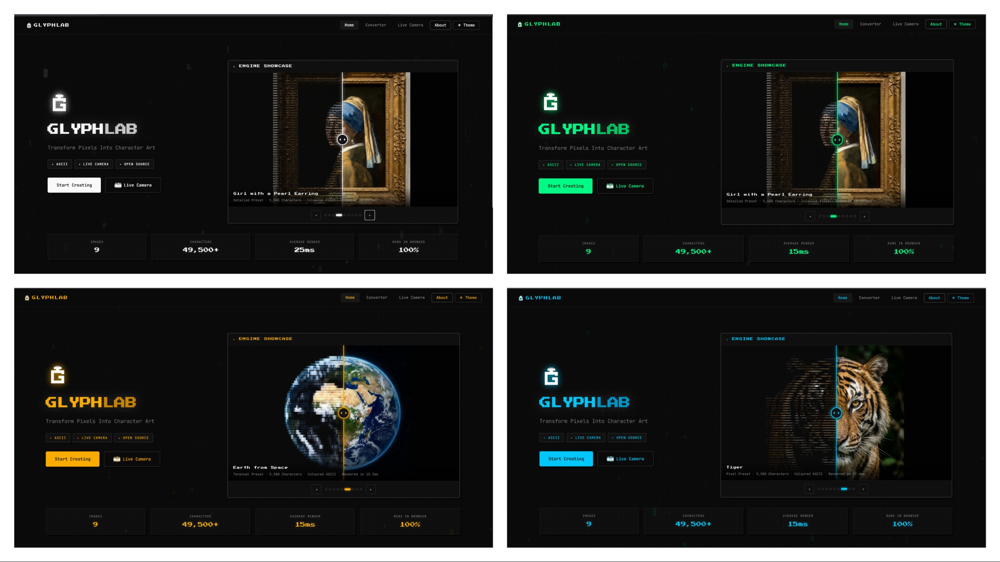

### About GLYPHLAB
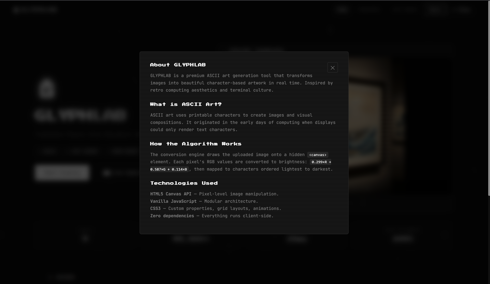

---

# How It Works

```
[ Upload / Camera ] ────► [ HTML5 Canvas ] ────► [ Pixel Brightness/RGB Mapping ]
                                                             │
[ Download / Copy ] ◄──── [ Render ASCII ] ◄─── [ Mapping to ASCII Characters ]
```

1.  **Image Drawing:** The source image is drawn onto a hidden `<canvas>` element at a normalized resolution.
2.  **Luminance Calculation:** Each pixel's RGB value is sampled and converted to a grayscale brightness value using the ITU-R BT.601 formula:
    $$\text{Luminance} = 0.299R + 0.587G + 0.114B$$
3.  **Contrast & Brightness Adjustment:** The sampled luminance is scaled according to user configuration.
4.  **Character Selection:** The luminance percentage is mapped directly to a index in the active character preset string (from lightest to darkest).
5.  **Color Processing (optional):** The original RGB values are preserved and applied to individual output spans for colorized rendering.

---

# Project Structure

```text
glyphlab/
├── assets/
│   ├── gallery/                # High-fidelity images for Hero Showcase
│   ├── icons/                  # UI control icons (camera, copy, downloads, lock)
│   ├── logos/                  # Brand assets (logo, favicon)
│   └── screenshots/            # Showcase screenshots (placeholders created)
├── css/
│   └── styles.css              # Main stylesheet (themes, layout, animations)
├── js/
│   ├── asciiEngine.js          # Core image processing & mapping logic
│   ├── export.js               # Handler for TXT, HTML, PNG, SVG downloads
│   ├── heroGallery.js          # Hero slideshow, comparison slider, & metrics
│   ├── ui.js                   # Theme management, particles, & modals
│   └── script.js               # Main page controller & user controls
├── index.html                  # Landing page with Showcase
├── camera.html                 # Live Webcam tool page
└── converter.html              # Drag-and-drop Image Converter page
```

---

# Installation & Run

Since GLYPHLAB is completely client-side and dependency-free, you do not need any compilation step. 

1.  **Clone the repository:**
    ```bash
    git clone https://github.com/Athxrv04/glyphlab.git
    cd glyphlab
    ```

2.  **Serve locally:**
    To avoid CORS issues when loading local canvas data, serve using any simple HTTP server:
    
    *Using Node.js:*
    ```bash
    npx http-server -p 8080 -c-1
    ```
    
    *Using Python:*
    ```bash
    python -m http-server 8080
    ```

3.  Open `http://localhost:8080` in your web browser.

---

# Copyright

© 2026 Atharv Sharma. All rights reserved.

GLYPHLAB is a personal portfolio project created to demonstrate frontend engineering, image processing, and UI/UX design.

The source code is publicly visible for learning and evaluation purposes. Please do not redistribute, republish, or present this project or substantial portions of its code as your own without prior permission.

<p align="center">
  Built with HTML5, CSS3 and Vanilla JavaScript. Retro terminal aesthetics preserved.
</p>
